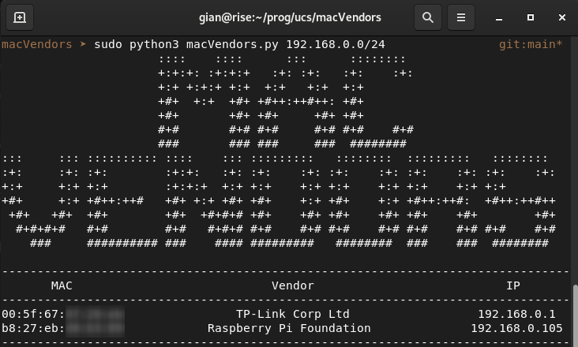

# macVendors

## Sobre o projeto
- Projeto em Python utilizado como instrumento de avaliação da disciplina de Redes de computadores II, na Universidade de Caxias do sul.

- A tarefa consistia em utilizar conceitos trabalhados em aula e criar uma nova ferramenta - ou aprimorar uma já existente - que trouxesse algum valor para os usuários, e disponibilizar ela publicamente.

- A ideia da criação deste código surgiu em uma época que meu trabalho era de Analista de Infraestrutura. A aplicação em uma situação real se deu uma semana após, quando um cliente solicitou ajuda para descobrir o motivo de um servidor perder a conexão de tempos em tempos. Ao analisar os logs do servidor, foi descoberto que existia um outro dispositivo com mesmo IP do servidor, causando conflito de endereços IP (camada 3). Com o uso desta ferramenta, foi possível identificar o fabricante do equipamento, tornando mais fácil a identificação e correção do endereço que estava afetando a rede.

- Como existe a necessidade de trabalhar com pacotes de camada 2, é importante que o usuário que utilizará o script tenha privilégios para a ação i.e. usuário root. 

## Instalação de requisitos
```bash
    pip3 install -f requirements.txt
```

## Utilização
O script deve ser iniciado atraves da linha de comando informando a rede a ser verificada.
```bash
    # python3 macVendors.py XXX.XXX.XXX.XXX/YY
```
Por exemplo, para uma rede 192.168.0.0/24, teriamos:
```bash
    # python3 macVendors.py 192.168.0.0/24
```
